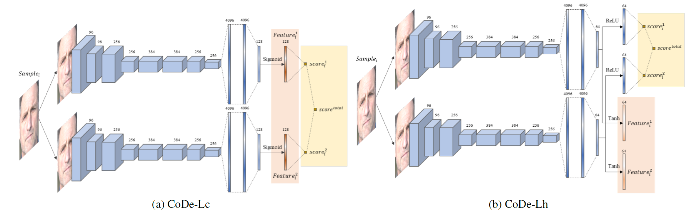

# IJCB-SynFacePAD-CoDe
Our Solution for IJCB SynFacePAD 2023 Competition (rank 3rd), reference: SynFacePAD 2023: Competition on Face Presentation Attack Detection Based on Privacy-aware Synthetic Training Data

## introduction



Our CoDe model is quite simple, due to a heavy overfitting we observed when utilizing bigger model. CoDe-Lc and CoDe-Lh (as shown in the above figure) are two ensemble models consisting of dual branches using AlexNet as backbone architecture.

For CoDe-Lc, the cosine similarity function was employed as the loss function to measure the discrepancy between the feature layers from each branch. Additionally, the Mean Squared Error (MSE) loss was used as an auxiliary metric to evaluate the similarity of features. The BCE loss was computed for the final prediction as well as each branch’s prediction. The total loss was calculated as the cumulative sum of all the aforementioned losses.

For CoDe-Lh, the cosine similarity was replaced with the hypersphere loss (Z. Li, H. Li, K.-Y. Lam, and A. C. Kot. Unseen face presentation attack detection with hypersphere loss. In ICASSP 2020 - 2020 IEEE International Conference on Acoustics, Speech and Signal Processing (ICASSP), pages 2852–2856, 2020.).

Both models were trained from scratch, utilizing a weighted sampling which was performed to ensure a bona fide-attack ratio of 1:1. The input images were resized to dimensions of 224×224, and data augmentation techniques were applied, including random horizontal flipping, scaling and rotating, gamma adjustment, RGB shifting, and color jittering. Moreover, for CoDe-Lh, additional augmentation was introduced by applying random Gaussian blur. The Adam optimizer with a learning rate of 1e-4 and weight decay of 5e-4 was utilized, along with an exponential learning scheduler with a gamma value of 0.998. The batch size during training was set to 128, and the number of training epoch was defined as 200.

## how to use

Please refer to the how_to_run.txt file in each folder for instructions on running the code.

Please note that the model doesn't require any pre-trained weights. The final results can be achieved entirely by training from the SynthASpoof dataset 
(https://github.com/meilfang/SynthASpoof).

## Acknowledgments

We would like to express our gratitude to the competition organizers whose significant contributions greatly impacted this competition.

I would also like to extend my thanks to all my collaborators who provided valuable insights and inspiration throughout this project.

Should you have any questions or suggestions regarding our method, please don't hesitate to reach out to us.

## Citation
If this project are valuable to your works, please cite the competition paper.

```
@inproceedings{ijcb2023synfacepad,
  title={SynFacePAD 2023: Competition on Face Presentation Attack Detection Based on Privacy-aware Synthetic Training Data},
  author={Fang, Meiling and Huber, Marco and Fierrez, Julian and Ramachandra, Raghavendra and Damer, Naser and others},
  booktitle={2023 IEEE International Joint Conference on Biometrics (IJCB)},
  year={2023},
  organization={IEEE}
}
```
